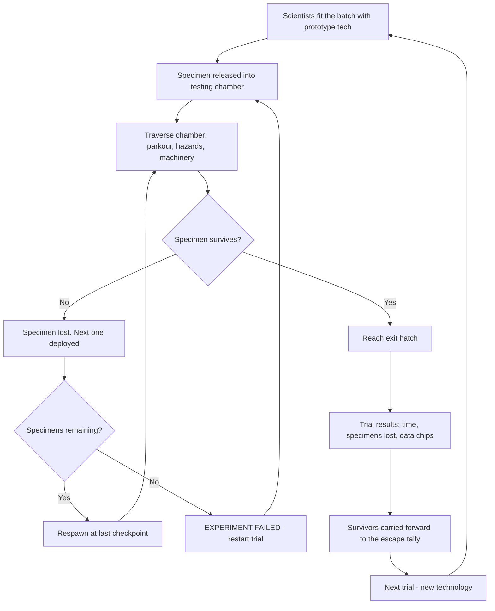
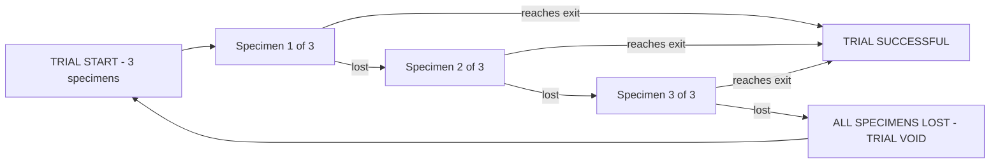
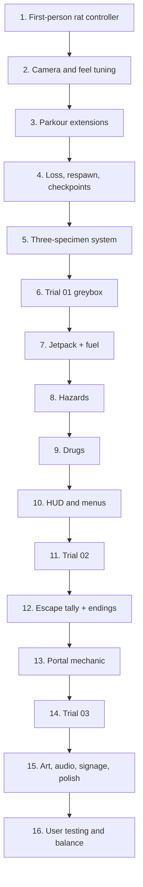

# Project R.A.T.

**Research Animal Trials** — a first-person parkour game set 150 years into the future.

> *Your group is Test Subjects 31. The scientists have given you a jetpack, a laser grid and a forty-metre drop.
> 3 trials, 3 rats to save. Will you lead them to safety?*

**Team:** Chocolate Bananas · **Engine:** Unity 6.3 LTS · **Platform:** WebGL (browser) · **Subject:** COMP30019

---

## Table of Contents

1. [Game Overview](#1-game-overview)
2. [Story and Narrative](#2-story-and-narrative)
3. [Gameplay and Mechanics](#3-gameplay-and-mechanics)
4. [Levels and World Design](#4-levels-and-world-design)
5. [Art and Audio](#5-art-and-audio)
6. [User Interface](#6-user-interface)
7. [Technology and Tools](#7-technology-and-tools)
8. [Team Communication, Timeline and Task Assignment](#8-team-communication-timeline-and-task-assignment)
9. [Possible Challenges](#9-possible-challenges)
10. [Scope Control and Minimum Viable Game](#10-scope-control-and-minimum-viable-game)
11. [References and Attribution](#11-references-and-attribution)

---

# 1. Game Overview

## 1.1 Core Concept

Project R.A.T. is a **first-person 3D parkour platformer** set roughly 150 years in the future.

Humanity has developed technologies that are currently science fiction — personal jetpacks,
stable laser portals, artificial gravity fields and cognition-enhancing pharmaceuticals. Before
any of it is approved for human use, it is tested on laboratory animals.

**The player is a laboratory rat.** Specifically, one of a batch of rats dosed with an
experimental intelligence enhancer, now intelligent enough to operate prototype equipment, and
intelligent enough to understand that it is a prisoner.

Each level is a single **experimental trial**: the scientists fit the rat with a piece of prototype
technology, release it into a purpose-built testing chamber, and record whether it reaches the
exit alive. The chambers are full of platforms, moving machinery, laser hazards, crushers, drops
and loose experimental drugs the researchers left lying around.

> **Objective: get at least one rat from the entry hatch to the exit alive.**

The player is issued **three rats per experiment**. A rat that dies is replaced from the batch
and the run resumes from the last checkpoint. If all three are lost, the experiment is recorded
as a failure and the level restarts. Survive all three trials and the rats escape the facility.

> 🖼️ **Figure 1 — Key art / cover illustration.** *Rat in first-person harness, neon lab
> corridor behind. See [Visual Assets](#visual-assets-checklist).*

## 1.2 Genre and Comparable Games

**Primary genre:** First-person 3D parkour platformer

**Secondary elements:** Science fiction, light environmental puzzle, dark comedy,
speedrun-friendly design

| Comparable game | What we share | How we differ |
|---|---|---|
| **Super Mario (3D titles)** | Level-per-mechanic structure; each level teaches one new ability, then tests it. Lives system. | We are first-person and momentum-driven rather than third-person discrete platforming. Our "lives" are diegetic — they are literally other test subjects. |
| **Sonic the Hedgehog** | Speed as the core pleasure; flowing routes rather than static jump puzzles. | Sonic's speed is largely on rails; ours is player-controlled through sprint, jetpack thrust and portal momentum in full 3D space. |
| **Only Up! / first-person climbers** | Continuous, uninterrupted vertical traversal; the movement *is* the game. | Only Up is punishing and near-featureless. We layer prototype technology, power-ups and a narrative on top, and we use checkpoints so failure costs a rat, not the run. |
| **Portal** | Sci-fi test-chamber framing; unseen scientists narrating your performance. | Portal is a puzzle game with movement; we are a movement game with light puzzles. |

**The short version:** the level-teaches-a-mechanic structure of Mario, the momentum of Sonic,
delivered as seamless first-person parkour rather than discrete platforming.

## 1.3 Target Audience

**Primary demographic: 13–22 year olds** who already play platformers and movement-focused
action games.

More specifically, players who want:

- **Parkour that feels good** — the moment-to-moment movement is the reason to play
- **A story wrapped around it** — a reason the obstacle course exists, and a reason to care
  about surviving it
- **Distinctive gameplay elements** — jetpacks, portals and experimental drugs rather than
  generic double-jumps

**Age-appropriateness note:** the tone is dark comedy, not horror. Rat deaths are stylised and
non-graphic, which keeps the game suitable for the lower end of the target range.

## 1.4 Unique Selling Points

| USP | Why it matters |
|---|---|
| **Diegetic lives** | Your three lives are three physical rats. Losing one is a narrative event, not a counter decrementing. |
| **A new prototype per experiment** | Each level hands you a new piece of technology and is built entirely around it. |
| **Drugs as temporary power-ups** | Consumables that change your *physical capabilities* mid-run, not just stats. |
| **You are being watched** | Scientists comment on your performance live. The level exists because someone is recording your results. |
| **First-person rat scale** | A first-person camera 15cm off the ground makes an ordinary lab bench into a skyscraper. The scale sells the fantasy for free. |
| **Story and mechanics progress together** | The rats get smarter as the player gets better. The escape is earned by mastering the scientists' own equipment. |

---

# 2. Story and Narrative

## 2.1 Setting

A vast corporate research complex, roughly 150 years from now, owned by an organisation
developing human-augmentation technology. Everything the company sells to humans is validated on
animals first.

The facility is clinical, well-funded and completely indifferent. Testing chambers are purpose-
built parkour courses; the maintenance levels behind them are rusted, flooded and unmonitored.

Three environments appear in the game, one per level:

| Sector | Character |
|---|---|
| **Mobility Testing Lab** | Clean, white, brightly lit, glass observation windows. Corporate and sterile. |
| **Propulsion Chamber** | Tall industrial vertical shaft. Scaffolding, exhaust vents, warning stripes. |
| **Containment / Exterior** | Damaged security sector opening onto the facility roof under a low-gravity field. Night, neon, rain. |

## 2.2 Backstory

The company develops a cognitive enhancer intended to increase human intelligence. It is tested
on rats first, as a formality.

It works far better than expected.

Within weeks the subjects can read hazard signage, operate equipment, anticipate the test
protocols and recognise the observation windows for what they are. The research team's response
is not to stop, it's to monetise. A test subject that can operate a jetpack is
enormously more valuable than one that cannot.

The rats keep passing the trials. The trials keep getting more dangerous. And with each new
piece of prototype equipment the scientists strap to them, the rats get one step closer to
having everything they need to get out.

## 2.3 Characters

**Test Subject 31 (the player)** — 3 identical enhanced laboratory rats. Never speaks. Personality is
conveyed through breathing, squeaks, the paws visible at the bottom of the screen, and how the
camera reacts to fear, impact and exhaustion. Wears a numbered harness with mounting points for
prototype equipment and faintly glowing injection marks along the flank.

**Unnamed doctor (lead researcher)** — Heard, never seen. Calm, clinical, entirely untroubled by the
mortality rate. Comments on the player's performance over the chamber intercom.

**The Technician** — The second voice. Younger, increasingly uncomfortable with what the
subjects are clearly capable of. Provides the comedy and, late in the game, the first hint that
someone in the building has noticed the rats are planning something.

> 🖼️ **Figure 2 — Character concept sheet.** *Rat harness design, ID tags, injection marks,
> jetpack mount.*

## 2.4 Narrative Progression

| Level | Story beat |
|---|---|
| **Trial 01** | Baseline assessment. The scientists are bored. The rat is a data point on a valuation sheet. |
| **Trial 02** | The jetpack test. Subject 31 performs beyond projection; the lead researcher orders the difficulty increased to generate better marketing figures. The Technician notes the subject appears to be *scouting*. |
| **Trial 03** | Containment failure. The rats use the portal device on an unauthorised route. Security engages. The scientists' commentary shifts from clinical to alarmed as the subjects breach the roof — and from alarmed to panicked once they realise what walking out of the building with the prototypes is worth. |

**Ending:** the surviving rats escape onto the facility exterior under the low-gravity field and
disappear into the city — carrying the prototypes with them. Closing shot implies the technology
intended for humans now belongs to something else.

## 2.5 Scientist Commentary

Delivered as intercom audio with subtitles. Triggered by player actions, which makes the
observation feel live rather than scripted.

| Trigger | Example line |
|---|---|
| Clears a difficult gap | *"Subject 31 cleared the eight-metre span. Log it. Increase the span."* |
| Dies immediately | *"...that's the third one this week. Fetch another. They're cheaper than the harness."* |
| Finds an unintended shortcut | *"It went **around** the course. Who designed this chamber?"* |
| One rat remaining | *"We are out of spares. If we lose this one the whole trial is void — and so is the quarter."* |
| Reaches the exit | *"Subject 31 has completed the trial. Prepare the next apparatus."* |
| Uses a drug pickup | *"It self-administered. Unprompted. Flag that for the pharmaceutical division."* |

---

# 3. Gameplay and Mechanics

## 3.1 Player Perspective

**First-person, mouse-look, no visible full-body character.**

The camera sits at rat height — approximately **0.15 units** above the floor — with a **wide
field of view (~90–100°)** to sell the speed. This is the single most important decision in the
project: at rat scale, a normal lab bench is a cliff, a floor vent is a tunnel and a dropped
pipette is cover. The environment does the work that expensive level geometry would otherwise
have to do.

**One batch, three bodies.** The three subjects are physically identical and share the
designation *Subject 31*; the facility does not distinguish between them, and neither does the
camera. The player inhabits one specimen at a time. When it dies, the view cuts to the next one
without ceremony — the same rat, from the facility's point of view, simply continuing the trial.
This is the point: to the company these are interchangeable units, and the player is the only
one keeping count.

**What the player sees of themselves:**

- Paws and forelimbs at the bottom of the frame during running, climbing and ledge grabs
- Equipped technology in view — jetpack nozzles flare into the lower frame; the portal device is
  held forward when aimed
- Screen-space effects for drug states (see [Drugs](#34-experimental-drugs))
- Camera shake, roll on landing, and a head-bob curve tuned to sprint speed

**Trade-off we are accepting:** first-person hides the rat, which weakens the "3 rats to save"
identity in the tagline. We mitigate this with (a) three identical specimen icons permanently on
the HUD, (b) a brief third-person death cam when a specimen is lost, and (c) the remaining
subjects visibly waiting in the holding pen behind the entry hatch, watching, at the start of
every attempt.

> 🖼️ **Figure 3 — First-person composition mock-up.** *Paws in frame, jetpack nozzles, HUD
> overlay, lab corridor at rat scale.*

## 3.2 Controls

| Input | Action |
|---|---|
| **W A S D** | Move |
| **Mouse** | Look / aim |
| **Left Shift** *(hold)* | Sprint |
| **Space** | Jump — hold at a wall to wall-run, tap at the apex to wall-jump |
| **Z** | Equipped technology — primary *(hold: jetpack thrust / Trial 03: fire portal A)* |
| **X** | Equipped technology — secondary *(Trial 03: fire portal B)* |
| **C** | Consume drug — slot 1 |
| **V** | Consume drug — slot 2 |
| **E** | Interact / collect |
| **R** | Restart from last checkpoint |
| **Esc** | Pause menu |

Design rules for the control scheme:

- **Left hand never leaves WASD.** Z, X, C and V are all reachable without moving off the
  movement keys — this is why they were chosen over number keys.
- **No combos, no chords, no double-taps.** Every action is one key.
- **Parkour is contextual.** Wall-running, ledge-grabbing and vaulting all resolve from Space
  plus movement direction. There is no separate climb button.
- All bindings are shown on the pause menu and taught by in-world signage in Trial 01.

## 3.3 Experimental Technology

**Two technologies ship in the game.** Each has one dedicated level plus a combined finale.

### 3.3.1 Jetpack — *Trial 02*

A miniature thruster harness mounted to the rat's back.

- **Hold Z** to thrust. Provides sustained upward force and strong air control.
- Consumes **fuel**, shown as a bar on the HUD. Fuel drains while thrusting.
- Fuel **regenerates only while grounded**, which forces a rhythm of burn → land → burn rather
  than continuous flight.
- Cannot fully replace jumping — max sustained thrust is roughly 2.5 seconds from full.

**Why it works for parkour:** it converts a failed jump into a recoverable one, so it raises the
skill ceiling without raising the frustration floor. It also makes vertical level design cheap.

**Why the company built it:** consumer personal mobility. Prototype posters throughout the
Propulsion Chamber advertise the human version at a preorder price.

### 3.3.2 Laser Portal Device — *Trial 03*

A wrist-mounted prototype that opens two linked apertures on valid surfaces.

- **Z** places portal A, **X** places portal B, on any surface flagged as portal-compatible
  (marked with a visible material — white panels only, not glass, grating or hazard surfaces).
- **Momentum is conserved through portals.** Entering fast means exiting fast.
- Only one pair exists at a time; placing a new A moves the old A.

**Why it works for parkour:** momentum conservation turns a long fall into a horizontal launch,
which is the single most satisfying traversal mechanic available to us and the reason Trial 03
can be the escape sequence.

**Why the company built it:** logistics and freight. It is also, unintentionally, the single
most valuable object in the building — which is why the escape matters commercially and not just
morally.

> 🖼️ **Figure 4 — Technology concept sketches.** *Jetpack harness and portal device mounted on
> the rat; portal-compatible surface material.*

<details>
<summary><strong>Cut technologies (retained as Assignment 2 stretch goals)</strong></summary>

Gravity manipulator, magnetic boots, dash module, energy shield. Each was cut to keep scope
achievable. If Trials 01–03 are complete, polished and performing well in WebGL before the
Assignment 2 deadline, the magnetic boots are the first candidate for reintroduction (they reuse
the wall-run system).
</details>

## 3.4 Experimental Drugs

**Two drugs ship in the game.** They are found in the level as pickups, not issued by the
scientists — the researchers simply left them within reach. The lead researcher's reaction to
seeing a subject self-administer is one of the game's running jokes: it is treated as a
promising product finding rather than as a warning sign.

Both are **temporary**, **timed**, and occupy a HUD slot until used. Carrying capacity is one of
each.

### Reflex Enhancer *(slot 1 — key C)*

- **Effect:** slows world time to ~40% for 5 seconds; player input speed is unaffected
- **Visual:** desaturated blue screen tint, chromatic aberration at the frame edges, heavy
  low-pass filter on all audio
- **Use case:** timing gaps in sweeping laser grids, lining up a mid-air portal shot
- **Cost:** the slow-down applies to *your* momentum too — it is precision, not speed

### Adrenaline *(slot 2 — key V)*

- **Effect:** +50% movement speed and +30% jump height for 8 seconds
- **Visual:** warm red vignette pulsing with a heartbeat, increased head-bob, motion blur at
  the frame edges
- **Use case:** clearing gaps otherwise out of range; escaping a collapsing or timed section
- **Cost:** significantly harder to control. Overshooting a platform at adrenaline speed is the
  most common way to lose a specimen.

<details>
<summary><strong>Cut drugs (retained as Assignment 2 stretch goals)</strong></summary>

Intelligence enhancer (highlights hidden routes), growth drug, shrinking drug, invulnerability.
The shrinking drug is the strongest candidate for reintroduction — it opens genuinely new routes
through existing geometry rather than only modifying movement values.
</details>

## 3.5 Core Gameplay Loop



## 3.6 The Three-Rat System

Each trial issues **three identical specimens** of Subject 31. They are the player's lives, and
they are diegetic.



**On loss:** a short third-person death cam plays, the HUD specimen icon greys out, the lead
researcher logs the loss over the intercom, and the next specimen is deployed at the last
checkpoint. Total interruption is under 2.5 seconds — failure must stay cheap enough to keep the
player attempting risky routes.

**On total loss:** the trial restarts from the beginning with a fresh batch of three. Because
checkpoints are generous, losing all three means the player was repeatedly failing the *same*
section, and a restart is a reasonable reset.

### The Escape Tally

The win condition for a trial is one specimen reaching the exit. The win condition for the
*game* is how many make it out of the building.

Every specimen the player does **not** lose is carried forward and counted at the end. Across
three trials the player can save **0 to 9 rats** — though a run is only survivable at all with at
least one per trial, so the practical range is 3 to 9.

| Rats escaped | Ending |
|---|---|
| **3** | One survivor per trial. The rats get out. The facility barely notices, and reorders. |
| **4–6** | A colony escapes into the city with a working prototype. The company opens an internal investigation. |
| **7–9** | Every specimen survives. The final shot shows the full batch on a rooftop with the portal device, and the closing line implies the company's product line now has a competitor. |

This is what makes the tagline's *"3 rats to save"* literal, and it gives the game a reason to
be replayed by an audience that would otherwise stop at the credits. It costs one integer of
persistent state and three variant ending screens.

## 3.7 Progression and Difficulty

Every level follows a four-beat structure: **Teach → Test → Combine → Master.**

| | Trial 01 | Trial 02 | Trial 03 |
|---|---|---|---|
| **New technology** | — (movement only) | Jetpack | Portal device |
| **Drugs available** | Adrenaline | Both | Both |
| **Hazards** | Static lasers, pits, crushers | + moving platforms, sweeping laser grids, exhaust vents | + security drones, timed containment doors, low gravity |
| **Gravity** | Standard | Standard | Low-gravity field on the exterior section |
| **Checkpoint density** | High | Medium | Medium |
| **Target completion** | ~2 min | ~3 min | ~4 min |

Difficulty rises through **route complexity and timing precision**, not through damage numbers.
There is no health bar: hazards are lethal on contact. This is deliberate — instant, readable
failure is what makes a parkour game feel fair.

## 3.8 Scoring and Replay

The end-of-trial screen reports **completion time**, **specimens lost** and **data chips
collected (0–3)**. A letter rank (S / A / B / C) is awarded from those three values.

Replay incentives: beating your own time, completing a trial without losing a specimen
("Clean Trial"), finding all three data chips, and raising the [escape tally](#the-escape-tally)
to unlock the best ending.

*Ranking and time-attack are the lowest-priority shipping features and will be cut first if
schedule pressure requires it. The escape tally is not — it is the payoff for the tagline and is
counted as a core feature.*

## 3.9 Checkpoints and Collectibles

- **Checkpoints** are diegetic *specimen scanners* mounted on the chamber walls. Passing one
  logs the position; the next specimen deploys there. Roughly one every 30–45 seconds of play.
- **Research Data Chips** — three per level, on optional routes reachable only with that level's
  technology. Collecting them unlocks internal audio logs on the main menu, which is where the
  commercial side of the backstory lives: valuations, launch timelines, and the memo where
  someone first asks whether the subjects should still be classified as animals.

## 3.10 Supporting the 10-Minute Assessment

The spec requires tutors to see all features within 10 minutes of play. Three provisions:

1. **Level Select on the main menu**, unlocked from the start, allowing any trial to be entered
   directly with its technology already equipped.
2. **Total intended playtime of the shipping build is 8–10 minutes** for a competent player
   across all three trials.
3. A **"Demo Run"** entry that starts the player in Trial 03 with both technologies and both
   drugs stocked, which showcases every mechanic and every shader in a single level.

---

# 4. Levels and World Design

## 4.1 Game World

The game is **fully 3D** with unrestricted movement on all three axes and a first-person camera.
We are explicitly *not* building a 2.5D or pixel-perfect 2D game — full 3D gives us the widest
possible choice of shaders for Milestone 3 and is required for portal momentum to be meaningful.

The world is **not open**. It is three discrete, self-contained testing chambers loaded as
separate Unity scenes, connected by the trial-results screen. This is a deliberate performance
decision for WebGL: each chamber can be individually budgeted for draw calls and lit
independently.

**Navigation:** there is **no map or minimap.** Testing chambers are linear-with-branches and
readable from the entry point. The player is guided by:

- **Colour language** — cyan indicates a traversable or interactive surface, red indicates
  lethal hazard, green indicates a collectible or drug (see [Colour Palette](#52-colour-palette))
- **Light** — the exit hatch is the brightest object visible from anywhere in the chamber
- **Sightlines** — every chamber is designed so the next objective is visible from the current
  checkpoint

> 🖼️ **Figure 5 — Level layout diagrams.** *Top-down and side-elevation sketches for all three
> trials, with checkpoint and data-chip placement marked.*

## 4.2 The Three Levels

### Trial 01 — Mobility Assessment

**Sector:** Mobility Testing Lab · **Technology:** none · **Target time:** ~2 minutes

A baseline assessment course. Clean white chamber, glass observation windows along one wall with
scientist silhouettes behind them, and a wall-mounted display cycling through the batch's
projected market value.

**Teaches:** WASD, mouse-look, sprint, jump, wall-run, ledge grab, the checkpoint scanners, the
three-specimen system, hazard readability, and the Adrenaline pickup.

**Layout:** a ground-level run of increasing gap widths → a wall-run section over a pit of
static laser emitters → a crusher corridor requiring timed sprints → a final gap that is
*deliberately too far to clear*, teaching the player to find and use the Adrenaline pickup on
the ledge beside it.

**Opening beat:** the player's first sight is the holding pen — the other two specimens of the
batch, identical, watching through the glass as the hatch opens.

### Trial 02 — Propulsion Test

**Sector:** Propulsion Chamber · **Technology:** Jetpack · **Target time:** ~3 minutes

A tall vertical industrial shaft. The player ascends. Falling is the primary failure state,
which makes the fuel bar the constant tension. Preorder posters for the consumer jetpack are
plastered up the shaft at regular intervals, getting more aspirational the higher you climb.

**Teaches:** thrust, fuel management, the burn-land-burn rhythm, and mid-air course correction.

**Layout:** a low tutorial alcove with unlimited fuel → an ascending spiral of platforms with
increasing spacing → sweeping horizontal laser grids that require Reflex Enhancer or precise
timing → moving exhaust-vent platforms that periodically fire upward, providing free lift if
timed correctly → a final unbroken vertical ascent on a single tank of fuel.

### Trial 03 — Containment Breach

**Sector:** Damaged security wing → facility exterior · **Technology:** Portal device (jetpack
retained) · **Target time:** ~4 minutes

The escape. Both technologies, both drugs, and the only level with an environmental gravity
change.

**Teaches:** portal placement, momentum conservation, and combining jetpack thrust with portal
exits.

**Layout:** a portal tutorial across an un-jumpable void → security corridors with sweeping
laser grids and patrolling drone spotlights → a fall chamber teaching momentum conservation
(fall into a floor portal, exit a wall portal at speed) → a breach through the facility hull
onto the **exterior roof under a low-gravity field**, where jump arcs triple and the city is
visible below → the final escape leap.

**Closing beat:** the escape tally resolves here. Whichever specimens survived across all three
trials appear on the rooftop for the final shot.

## 4.3 Objects

| Object | Role | Interaction |
|---|---|---|
| **Test specimens (Subject 31 ×3)** | Playable characters. Physically identical, interchangeable, three per trial. | Controlled one at a time. Lethal contact with any hazard removes the active specimen. |
| **Holding pen** | Where the unused specimens wait, visible at the entry hatch. | Non-interactive. Exists to keep the remaining lives visible in a first-person game. |
| **Technology pickups** | Jetpack, portal device. Equipped at the start of a trial via a scientist-operated apparatus. | Automatically equipped on entry; bound to Z and X. |
| **Drug pickups** | Reflex Enhancer, Adrenaline. Glowing vials on ledges and off-route paths. | Walk over to collect into a HUD slot. Consumed with C / V. |
| **Static hazards** | Laser emitters, spike beds, bottomless pits, exposed coolant. | Lethal on contact. Always emissive red and always audible before they are visible. |
| **Dynamic hazards** | Crushers, sweeping laser grids, exhaust vents, security drones. | Move on fixed loops. Vents can be used as launch pads; drones are avoided, not fought. |
| **Traversal geometry** | Platforms, pipes, ledges, wall-run panels, grating, moving platforms. | Standard collision. Wall-runnable surfaces are visually distinct. |
| **Portal surfaces** | White panelled walls flagged as portal-compatible. | Accept portal placement. All other surfaces reject it with an audible error tone. |
| **Checkpoint scanners** | Progress markers. | Trigger on pass-through; next specimen deploys here. |
| **Data chips** | Optional collectibles, three per trial. | Collected on contact; unlock internal audio logs. |
| **Exit hatch** | Level goal. | Trigger volume ending the trial. |
| **Scientists** | Non-interactive background. Silhouettes behind observation glass; voices on the intercom. | Cannot be reached or affected. They are scenery and narration. |
| **Commercial signage** | Preorder posters, launch countdowns, valuation displays, marketing mock-ups of humans using the prototypes. | Non-interactive. Carries the monetisation thread of the story without a single cutscene. |
| **Environmental dressing** | Beakers, cages, monitors, cabling, warning signage, disposal chutes. | Non-interactive; carries environmental storytelling. |

## 4.4 Physics

Physics are **broadly realistic**, with deliberate exceptions where realism would harm the feel.

**Player controller.** The rat uses a **kinematic character controller with custom gravity and
velocity integration**, not a physics-driven Rigidbody. Rigidbody players in Unity are
unpredictable at speed, catch on geometry seams, and are far harder to tune — for a game where
movement quality *is* the product, deterministic control is worth more than physical accuracy.

| Parameter | Value / behaviour |
|---|---|
| **Baseline gravity** | −9.81 m/s², scaled to rat proportions so falls read correctly at 0.15-unit eye height |
| **Air control** | Retained but reduced (~60% of ground acceleration) — enough to correct a jump, not enough to fly |
| **Terminal velocity** | Capped, to keep long falls readable and survivable-looking |
| **Coyote time** | ~0.12 s grace period after leaving a ledge |
| **Jump buffering** | ~0.15 s input buffer before landing |
| **Momentum on landing** | Preserved. Sprint speed is not reset by a clean landing — this is what makes chained parkour feel continuous. |

**Non-standard gravity by level:** Trial 03's exterior section applies a **low-gravity field**
(approximately 0.3g), tripling jump arcs and extending jetpack hang time. Gravity is a
per-scene parameter on the controller so additional gravity zones remain cheap to add.

**Jetpack:** a continuous upward force applied while thrust is held, opposed by gravity, with a
velocity cap so that holding Z indefinitely does not produce unbounded ascent.

**Portals:** momentum is conserved through the aperture. Exit velocity magnitude equals entry
velocity magnitude, rotated into the exit portal's local space. This is implemented as an
explicit velocity transform on the controller rather than through the physics engine.

**Everything else** — crates, debris, loose lab equipment, drone wreckage — uses standard Unity
Rigidbody physics. These objects are decorative and non-load-bearing, which caps the active
physics object count for WebGL performance.

---

# 5. Art and Audio

## 5.1 Art Style

**Stylised low-poly with strong emissive accents.**

Clean, low-triangle geometry with flat or lightly textured surfaces, lit primarily by
**emissive materials and baked lighting** rather than many real-time lights. The aesthetic
target is a bright, over-designed corporate laboratory — the future as imagined by a marketing
department — undercut by what is actually happening inside it. Every chamber should look like it
was designed to be photographed for a product launch, and then used for something else.

This choice is driven as much by constraints as by taste:

- Low-poly geometry keeps the WebGL build small and fast
- Baked lighting plus emissive materials avoids expensive real-time shadow passes
- Flat surfaces are the ideal canvas for custom shaders, which is where our Milestone 3 marks are
- It is achievable by a team with no dedicated 3D artist

**Visual references:** Portal (clinical test-chamber design), Mirror's Edge (colour as
navigation guidance), Superhot (extreme material simplicity, high readability).

> 🖼️ **Figure 6 — Art direction mood board.** *Reference images for lab interiors, emissive
> signage, low-poly stylisation.*

## 5.2 Colour Palette

Colour is a **gameplay system**, not decoration. The player learns the language in Trial 01 and
relies on it for the rest of the game.

| Role | Colour | Hex | Usage |
|---|---|---|---|
| Environment base | Clinical white | `#F2F4F7` | Walls, panels, floors |
| Environment shadow | Cool grey | `#8A93A3` | Structure, framing, non-interactive |
| **Safe / interactive** | Cyan | `#3FE0FF` | Wall-run surfaces, checkpoints, exit hatch |
| **Lethal** | Hazard red | `#FF3B47` | All lasers, crushers, drones, hazard signage |
| **Consumable** | Bio green | `#5BFF9B` | Drug vials, data chips |
| Technology | Warm orange | `#FF9A3C` | Jetpack exhaust, portal apparatus |
| Portal A / B | Violet / amber | `#B14BFF` / `#FFC53F` | Portal apertures |
| Corporate signage | Brand blue | `#2B6CFF` | Preorder posters, valuation displays, launch countdowns |
| Maintenance sector | Rust brown | `#6B4A2F` | Trial 03 damaged sections |

**No hazard is ever cyan. No safe surface is ever red.** This rule is absolute.

> 🖼️ **Figure 7 — Colour palette swatch.**

## 5.3 Shader Plan

Each team member implements one custom Cg/HLSL shader for Milestone 3. The art direction above
exists partly to make these shaders the visual centrepiece — flat, simply-lit surfaces make a
custom shader read clearly.

| Member | Shader | Where it appears | Key exposed parameters |
|---|---|---|---|
| [Member 1] | **Holographic laser barrier** — scrolling noise, Fresnel edge glow, animated scanlines, emissive | All laser hazards, all three trials | Colour, scroll speed, scanline density, Fresnel power, intensity |
| [Member 2] | **Portal surface** — screen-space refraction/distortion, swirl UV warp, animated rim | Trial 03 portal apertures | Distortion strength, swirl rate, rim colour, aperture radius |
| [Member 3] | **Jetpack exhaust and heat haze** — vertex displacement on a cone mesh + UV-offset heat distortion | Trials 02 and 03, permanently in first-person view | Thrust intensity (driven by fuel input), plume length, distortion strength, gradient colours |
| [Member 4] | **Drug-vision screen effect** — full-screen post-process: chromatic aberration, pulsing vignette, saturation shift | Whenever a drug is active | Aberration offset, vignette radius, pulse frequency, tint colour |

Each shader is driven by live gameplay values (jetpack fuel, drug timer remaining), which
satisfies the "meaningful, adjustable parameters producing clear visual variations" criterion
without requiring a separate demo scene.

*If the team has three members, the drug-vision shader is reassigned and a fourth is not
required.*

<details>
<summary><strong>Reserve shader concepts</strong></summary>

If a member wants a different effect, or if one of the above proves unsuitable: an animated
holographic display shader for the corporate signage and valuation screens; a specimen dissolve
shader for the death effect; a wet-surface/rain shader for the Trial 03 exterior.
</details>

## 5.4 Sound and Music

**Music** — sparse, synth-driven, tension-building. Each sector has one loop:

| Sector | Track character |
|---|---|
| Trial 01 | Cold, minimal, clinical. Ambient hum and slow pads. |
| Trial 02 | Driving percussion, industrial. Rises with vertical progress. |
| Trial 03 | Urgent, alarm-inflected, resolving into open synth on the exterior. |
| Menus | Quiet corporate ambience — the sound of a waiting room, with a product jingle looping just too quietly to place. |

**Rat audio** — breathing (rate scales with sprint), claw scrabbles on different surface
materials, squeaks on impact and fear, panting after a long sprint. This is the primary channel
for the player character's personality given the first-person camera.

**Technology audio** — jetpack ignition, sustained thrust with a pitch that rises as fuel
depletes, portal placement chirp, portal transit whoosh, drug injection hiss followed by a
filtered audio shift for the duration.

**Environmental audio** — laser hum (audible before the emitter is visible, which is a
gameplay-critical cue), crusher hydraulics, drone rotors with distance falloff, distant alarms,
the intercom click that precedes every scientist line, and looping promotional voiceover from
the signage screens.

**Diegetic mixing:** the entire mix is low-pass filtered while Reflex Enhancer is active, and
sound occludes through walls — the player should be able to hear a hazard around a corner.

## 5.5 Tone

The register is **corporate science fiction with dark comedy**, never horror. The joke is always
on the company, never on the rats.

Specimen deaths are **fast, stylised and non-graphic** — a laser hit is a flash and a puff, not
an injury. There is no blood and no gore. Failure should read as *expensive* rather than
*upsetting*: the intercom logs the loss like a line item, and the game moves on. This keeps the
game appropriate for the 13-year-old end of our target audience while making the company's
indifference the actual subject of the humour.

## 5.6 Assets

*Asset sourcing is to be finalised in Week 7 alongside the prototype build. This section will be
completed with a candidate list, source URLs and licences before the Milestone 3 submission.*

**Intended approach:**

- **Geometry** — built in-engine from Unity primitives and ProBuilder where possible; the
  low-poly art direction is chosen specifically so that most environment art can be team-made
- **Rat model** — sourced or commissioned; the only model requiring genuine artistic skill, and
  the fact that all three specimens are identical means we need exactly one
- **Signage and posters** — team-made in GIMP/Krita. Cheap to produce, high storytelling value.
- **Audio** — sourced from freely licensed libraries (Freesound, Kenney), with all sources
  recorded in [References](#11-references-and-attribution)
- **Unity Asset Store** — used only for artistic assets (models, textures, audio) as permitted
  by the spec. **No code, components, game logic or non-artistic prefabs will be imported.**

Every external asset will be listed with its source URL and licence in the References section
before submission.

---

# 6. User Interface

## 6.1 HUD

The HUD is designed as **the scientists' telemetry overlay**, not the rat's — it is diegetically
what the researchers see on their monitors, which is why it exists at all in a first-person
game. Styled as thin cyan vector lines on transparent black, matching the lab's screen
aesthetic.

```
┌────────────────────────────────────────────────────────────┐
│  SUBJECT 31  ·  SPECIMEN 2 OF 3              TRIAL 02      │
│                [🐀][🐀][☠]                   00:47.21      │
│                                                            │
│                                                            │
│                            ·                               │
│                       (crosshair —                         │
│                     Trial 03 only)                         │
│                                                            │
│                                                            │
│                                                            │
│  ┌──────────────┐                              ◆ ◆ ◇       │
│  │ FUEL ████░░░ │                           DATA CHIPS     │
│  └──────────────┘                                          │
│   [C] REFLEX    [V] ADRENALINE                             │
└────────────────────────────────────────────────────────────┘
```

> 🖼️ **Figure 8 — HUD wireframe.** *Replace the ASCII mock above with a drawn wireframe.*

**Required information, and why each element earns its screen space:**

| Element | Position | Justification |
|---|---|---|
| **Specimen icons ×3** | Top centre | The only persistent reminder of the three-specimen system in first-person. Identical icons, not portraits — the specimens are interchangeable. Greys out on loss. |
| **Specimen counter** | Top left | `SPECIMEN n OF 3`, in the facility's own logging language. |
| **Fuel bar** | Bottom left | Only shown when the jetpack is equipped. Constant tension in Trial 02. |
| **Drug slots** | Bottom left, under fuel | Shows carried drugs, keybind, and a radial timer while active. Empty slots are dimmed. |
| **Trial timer** | Top right | Drives replay and ranking. |
| **Data chip counter** | Bottom right | Three diamonds, filled on collection. |
| **Crosshair** | Centre | **Trial 03 only** — appears with the portal device, absent otherwise so the screen stays clean. |
| **Active drug effect** | Full-screen | Handled by the drug-vision shader, not by HUD elements. |
| **Subtitles** | Bottom centre | Scientist commentary. Always on. |

**Nothing else appears on screen.** No health bar (contact is lethal), no ammo, no minimap.

## 6.2 Menus

**Main menu** — the game presented as a research terminal. Options: *Begin Trials*, *Level
Select*, *Demo Run*, *Audio Logs*, *Controls*, *Settings*. Background shows a slowly rotating
observation view of an empty testing chamber, with the batch valuation ticking over in the
corner.

**Pause menu** — *Resume*, *Restart Checkpoint*, *Restart Trial*, *Controls*, *Quit to Menu*.
Full control reference always visible on this screen.

**Specimen lost screen** — deliberately minimal and fast, since it appears often. A brief red
flash, the specimen icon greying out with `SPECIMEN LOST — DEPLOYING REPLACEMENT`, and an
automatic respawn. Under 2.5 seconds.

**Trial failed screen** — `ALL SPECIMENS LOST · EXPERIMENT VOID`, shown as a research log entry
with the trial statistics and a line noting the cost of the wasted batch. Options: *Retry
Trial*, *Quit to Menu*.

**Trial complete screen** — a results readout in the scientists' voice: completion time,
specimens lost, chips recovered, letter rank, and the next apparatus being prepared. The
**running escape tally** is shown here so the player understands it is accumulating before the
ending arrives.

**Ending screen** — one of three variants selected by the escape tally (see
[The Escape Tally](#the-escape-tally)).

> 🖼️ **Figure 9 — Menu wireframes.** *Main menu and trial-complete screen.*

---

# 7. Technology and Tools

| Tool | Version | Purpose | Justification |
|---|---|---|---|
| **[Unity](https://unity.com/releases/editor/whats-new/6000.3.18f1#notes)** | 6.3 LTS | Engine — movement, physics, rendering, audio, UI, WebGL build | Required by the spec. |
| **Universal Render Pipeline (URP)** | Bundled with Unity 6.3 | Rendering | Required for reliable WebGL performance and full custom shader support. Built-in RP would restrict our shader options; HDRP is not viable in a browser. |
| **[GitHub](https://github.com)** | — | Version control, collaboration, contribution tracking, GitHub Pages deployment | Required by the spec. |
| **Cg / HLSL** | — | Custom shader programs (Milestone 3, individually assessed) | Required by the spec. |
| **[Visual Studio Code](https://code.visualstudio.com/)** | Latest | C# and shader editing | Free, lightweight, good Unity and HLSL tooling. |
| **[ProBuilder](https://docs.unity3d.com/Packages/com.unity.probuilder@latest)** | Unity package | In-editor level geometry | Lets us block out and iterate on testing chambers without external 3D software — critical given no dedicated 3D artist. |
| **[Blender](https://www.blender.org/)** | 4.x | Rat model and prop adjustments | Free; used only where a team member already has the skill. |
| **[Audacity](https://www.audacityteam.org/)** | Latest | Audio trimming and processing | Free, sufficient for our needs. |
| **[GIMP](https://www.gimp.org/) / [Krita](https://krita.org/)** | Latest | Textures, UI elements, corporate signage, concept art | Free. |

**Version control conventions:**

- `main` is always deployable and always contains the latest submitted state
- Feature branches named `feature/<area>` (e.g. `feature/jetpack`, `feature/portal-shader`)
- Pull requests reviewed by at least one other member before merging to `main`
- **Unity-specific:** Visible Meta Files and Force Text asset serialisation are enabled; scenes
  and prefabs are treated as **owned by one person at a time** to avoid unmergeable conflicts
  (see [Merge Conflicts](#93-merge-conflicts))

---

# 8. Team Communication, Timeline and Task Assignment

## 8.1 Communication

| Channel | Use | Frequency |
|---|---|---|
| **In-class discussion** | Quick decisions, tutor questions, live problem-solving | Weekly, during workshops |
| **Weekly team meeting (outside class)** | Progress review, task reassignment, integration, playtesting the current build together | Weekly, fixed day and time |
| **Group chat** | Day-to-day coordination, blockers, quick questions, sharing screenshots | Continuous |
| **GitHub (issues, PRs, commit history)** | All technical coordination and the authoritative record of contribution | Continuous |

**Working agreements:**

- **All project communication is in English**, as required by the spec.
- Every member **commits and pushes at least twice a week**, even for work in progress. The
  commit history is evidence of contribution and is used in dispute resolution.
- Blockers are raised in the group chat **the day they occur**, not at the next meeting.
- The weekly meeting always ends with each member stating their tasks for the coming week.
- Every member builds and runs the **WebGL build** at least once a week — editor-only testing is
  not sufficient and hides the problems that actually cost marks.

## 8.2 Timeline

**Fixed milestone deadlines (from the specification):**

| Milestone | Deliverable | Due |
|---|---|---|
| 1 | Team Declaration | Sun 16 Aug — ✅ complete |
| 2 | **Game Design Document** | **Sun 6 Sep, 11:59pm** |
| 3 | Working Prototype and Shaders | Sun 13 Sep, 11:59pm |
| 4 | Interactive Oral Assessment (individual) | Week 8–9 tutorials |
| 5 | Team Member Evaluation (individual) | Sun 20 Sep, 11:59pm |

**Internal plan:**

| Week | Focus | Deliverable at week's end |
|---|---|---|
| **Wk 6** *(to 6 Sep)* | GDD completion. Concept sketches, level diagrams, HUD wireframe, palette. Shader assignments confirmed. | **GDD submitted in `README.md`** |
| **Wk 7** *(to 13 Sep)* | First-person controller, camera, three-specimen system, Trial 01 greybox, jetpack, one WebGL build early in the week. Each member's shader developed in parallel and integrated by Thursday. | **Prototype + 4 shaders submitted** |
| **Wk 8–9** | Individual oral assessments. Team member evaluations. Post-Milestone-3 retrospective and Assignment 2 planning. | IOA complete, evaluations submitted |
| **Wk 10** | Trial 02 built and playable end to end. Drug system implemented. Escape tally state added. Audio pass begins. | Trials 01–02 playable |
| **Wk 11** | Portal mechanic and Trial 03. Low-gravity section. Full menu flow including Level Select, Demo Run and the three ending variants. | All three trials playable |
| **Wk 12** | Art and audio pass, corporate signage, UI polish, WebGL performance optimisation to hold 30+ FPS. | Feature-complete build |
| **Wk 12–13** | **User testing.** Bug fixing and balance from testing feedback. Final GDD update. | **Assignment 2 submission** |

**User testing plan:** the target audience of 13–22 year old platformer players is directly
reachable through the UniMelb student cohort, and because the game is a WebGL build, a test
session requires nothing more than sending a link. Recruitment begins in Week 11 so sessions can
run as soon as the feature-complete build exists.

**Critical-path risk:** the first-person controller blocks nearly everything else. It is the
first thing built in Week 7 and is assigned to the member with the most Unity experience.

## 8.3 Task Assignment

*Names to be assigned at the Week 6 meeting.*

| # | Task | Owner | Target week | Status |
|---|---|---|---|---|
| 1 | First-person rat controller (movement, sprint, jump) | | Wk 7 | Not started |
| 2 | Parkour extensions (wall-run, wall-jump, ledge grab) | | Wk 7 | Not started |
| 3 | Camera, FOV, head-bob, landing roll | | Wk 7 | Not started |
| 4 | Three-specimen system, loss, respawn, checkpoints | | Wk 7 | Not started |
| 5 | Trial 01 greybox | | Wk 7 | Not started |
| 6 | Jetpack mechanic and fuel system | | Wk 7 | Not started |
| 7 | **Shader — laser barrier** | | Wk 7 | Not started |
| 8 | **Shader — portal surface** | | Wk 7 | Not started |
| 9 | **Shader — jetpack exhaust / heat haze** | | Wk 7 | Not started |
| 10 | **Shader — drug-vision post-process** | | Wk 7 | Not started |
| 11 | Hazard system (lasers, crushers, vents) | | Wk 10 | Not started |
| 12 | Drug system and both drug effects | | Wk 10 | Not started |
| 13 | Trial 02 full build | | Wk 10 | Not started |
| 14 | Escape tally — persistent state and three endings | | Wk 10 | Not started |
| 15 | Portal mechanic with momentum conservation | | Wk 11 | Not started |
| 16 | Trial 03 full build + low-gravity section | | Wk 11 | Not started |
| 17 | HUD implementation | | Wk 11 | Not started |
| 18 | Menu flow, Level Select, Demo Run | | Wk 11 | Not started |
| 19 | Rat model, animation and materials | | Wk 10–12 | Not started |
| 20 | Environment art and modular lab kit | | Wk 12 | Not started |
| 21 | Corporate signage and poster art | | Wk 12 | Not started |
| 22 | Audio implementation and mixing | | Wk 12 | Not started |
| 23 | Scientist commentary — writing and trigger system | | Wk 12 | Not started |
| 24 | WebGL performance optimisation | | Wk 12 | Not started |
| 25 | User testing organisation and analysis | | Wk 12–13 | Not started |
| 26 | GDD maintenance (living document) | | Ongoing | Ongoing |

**Balance principle:** each member owns at least one **movement/mechanic** task, one **level or
art** task, and exactly one **shader**. No member owns only support work.

---

# 9. Possible Challenges

## 9.1 Movement Feel — *highest risk*

A parkour game is worthless if the movement is not enjoyable, and movement feel cannot be
designed on paper. **Mitigation:** the controller is built first, in Week 7, and tested in a bare
greybox room before any level art exists. Every team member plays it and gives feedback at the
weekly meeting. Tuning values (acceleration, air control, coyote time, jump buffer) are exposed
in the Inspector so they can be adjusted without recompiling.

## 9.2 First-Person at Rat Scale

A 0.15-unit-high camera in a normal-scale environment introduces problems that a human-height
camera does not: near-plane clipping through geometry, disorienting head-bob, motion sickness at
high FOV, and difficulty judging distances. **Mitigation:** prototype the camera in Week 7
specifically at final scale, tune the near clipping plane early, and provide FOV and head-bob
sliders in the settings menu so players can reduce motion sickness. If rat scale proves
unworkable we raise the eye height rather than abandoning first-person.

## 9.3 Merge Conflicts

Unity scene and prefab files are effectively unmergeable. Multiple people editing the same scene
will destroy work. **Mitigation:** Force Text serialisation and Visible Meta Files enabled from
day one; **scenes are locked to a single owner at a time**, announced in the group chat; work is
prefab-based wherever possible so members edit separate files; feature branches with reviewed
pull requests; `main` is never committed to directly.

## 9.4 WebGL Performance

The 30 FPS requirement is a hard marking criterion, and WebGL is far less forgiving than the
editor. Custom shaders, particle effects and real-time lighting are all risks. **Mitigation:**
build to WebGL **weekly from Week 7**, not before deadlines. Baked lighting, emissive materials
instead of real-time lights, low-poly geometry, capped active Rigidbody count, and one
self-contained scene per trial. The `Assets` folder is monitored against the 250 MB limit
throughout.

## 9.5 Portal Implementation

Momentum-conserving portals are the most technically demanding feature in the game, and the
naive implementations have serious edge cases (clipping on transit, recursive rendering cost,
camera discontinuity). **Mitigation:** the portal mechanic is scheduled for Week 11, deliberately
*after* the rest of the game is playable, so that it can be simplified or cut without
invalidating the project. A reduced fallback — non-visual "teleport pads" that preserve momentum
without rendering the far side — is pre-approved as the contingency, and Trial 03 is designed so
that it remains completable with the fallback.

## 9.6 Keeping the Rats Visible in First-Person

The tagline promises three rats to save, but a first-person camera shows none of them. If the
player never forms an attachment to the batch, the escape tally and the endings lose their
weight. **Mitigation:** the holding pen at each entry hatch, the identical specimen icons on the
HUD, the third-person loss cam, and the running tally on every results screen. This is
explicitly a thing to test in Week 12 user testing — if players cannot say how many rats they
have saved, the framing has failed and the HUD needs to be louder.

## 9.7 Scope

The original concept included six technologies, six drugs and eight levels. That was not
deliverable. **Mitigation (already applied):** the shipping scope is fixed at **two technologies,
two drugs and three levels**. Cut features are documented as stretch goals and will only be
reconsidered if the core game is complete, polished and performing before the Assignment 2
deadline. Any proposal to add a feature must be raised at a weekly meeting and must name the
feature it replaces.

## 9.8 Uneven Contribution

**Mitigation:** every member owns clearly named tasks in the table above; the commit history
provides an objective record; blockers are surfaced weekly rather than discovered at deadlines;
concerns are raised through the FeedbackFruits evaluation process as the spec requires, not by
email.

---

# 10. Scope Control and Minimum Viable Game

## 10.1 Design Pillars

Every decision is tested against these four. A feature that does not serve one of them is cut.

1. **Movement is fun on its own.** Running, jumping and thrusting should be enjoyable in an empty
   room with no objective.
2. **Every trial introduces something new.** No level reuses the previous level's toolkit
   unchanged.
3. **Protect the batch.** Failure must cost something without becoming frustrating, and the
   player must always know how many rats they have left to save.
4. **The laboratory is watching, and it is counting the money.** Scientists, signage and
   environment should keep the player aware they are inside someone else's product development
   cycle.

## 10.2 Minimum Viable Game

If everything goes wrong, this is what must still exist:

- One rat, first-person, running and jumping in one testing chamber
- Three-specimen system with loss, respawn and checkpoints
- Jetpack with fuel
- One drug (Adrenaline)
- Lasers, pits and one moving platform
- HUD showing specimens, fuel and drug slot
- Trial complete and trial failed screens
- Running in WebGL at 30+ FPS

Everything beyond this list is built in the priority order below.

## 10.3 Build Order



**Rule:** the movement system must be enjoyable before any significant environment art is
produced. Art built around bad movement is art that gets thrown away.

## 10.4 Locked Design Decisions

| Decision | Value |
|---|---|
| Team | Chocolate Bananas |
| Perspective | **First-person** |
| Dimensionality | **Full 3D** |
| Setting | Corporate research facility, ~150 years in the future |
| Player character | Three identical enhanced laboratory rats, designation Subject 31 |
| Antagonist | The company. No named villain; the lead researcher is unnamed. |
| Company motive | **Monetisation** — the prototypes are products in development |
| Core gameplay | Seamless parkour traversal |
| Lives | Three specimens per trial, diegetic and interchangeable |
| Fail condition | All three specimens lost |
| Win condition (trial) | One specimen reaches the exit hatch |
| Win condition (game) | Escape tally — 3 to 9 rats saved across three trials, three endings |
| **Technologies shipping** | **Jetpack, laser portal device** |
| **Drugs shipping** | **Reflex Enhancer, Adrenaline** |
| **Levels shipping** | **Three** |
| Health system | None — hazards are lethal on contact |
| Map / minimap | None |
| Engine | Unity 6.3 LTS, URP |
| Deployment | WebGL |
| Version control | GitHub |
| Art style | Stylised low-poly, emissive accents |
| Tone | Corporate science fiction, dark comedy, non-graphic |

## 10.5 Game Identity

> **A first-person parkour game where three identical laboratory rats must survive three
> increasingly lethal product trials — using a jetpack, a prototype portal device and the
> researchers' own experimental drugs — and where the only thing that matters at the end is how
> many of them you got out of the building.**

---

## Visual Assets Checklist

Figures to be produced and inserted before the Milestone 2 deadline:

- [ ] **Figure 1** — Key art / cover illustration
- [ ] **Figure 2** — Rat character concept sheet (harness, ID tag, injection marks)
- [ ] **Figure 3** — First-person composition mock-up
- [ ] **Figure 4** — Technology concept sketches (jetpack, portal device)
- [ ] **Figure 5** — Level layout diagrams, all three trials
- [ ] **Figure 6** — Art direction mood board
- [ ] **Figure 7** — Colour palette swatch
- [ ] **Figure 8** — HUD wireframe
- [ ] **Figure 9** — Menu wireframes

Optional but cheap and high-value:

- [ ] A mock corporate preorder poster for the consumer jetpack — sells the monetisation theme in
      one image

Added after Milestone 3:

- [ ] Prototype screenshots
- [ ] Shader before/after comparisons
- [ ] Movement GIF

Store images in `docs/images/` and embed with ``.

---

# 11. References and Attribution

*No external resources have been used at the time of writing.*