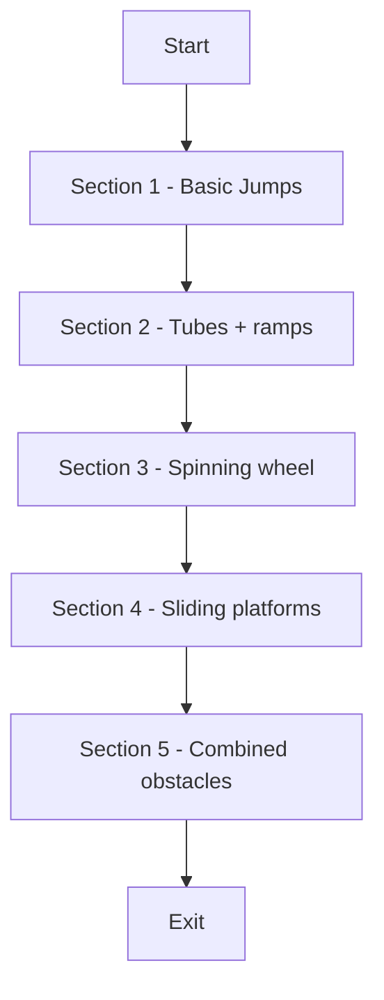
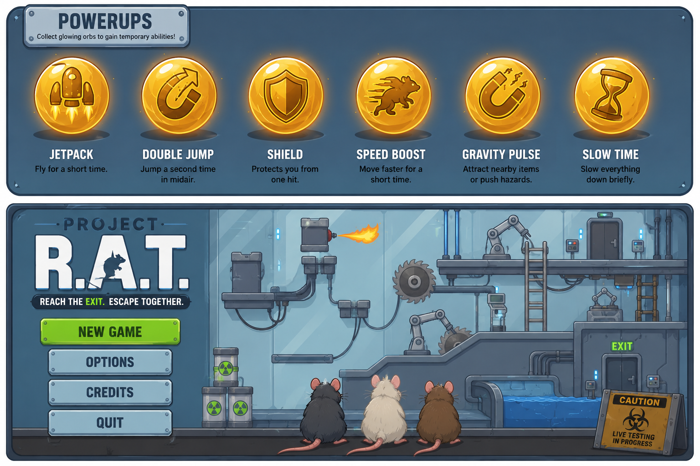
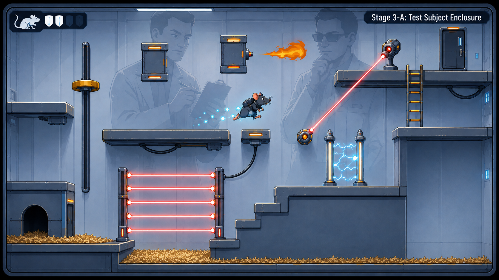
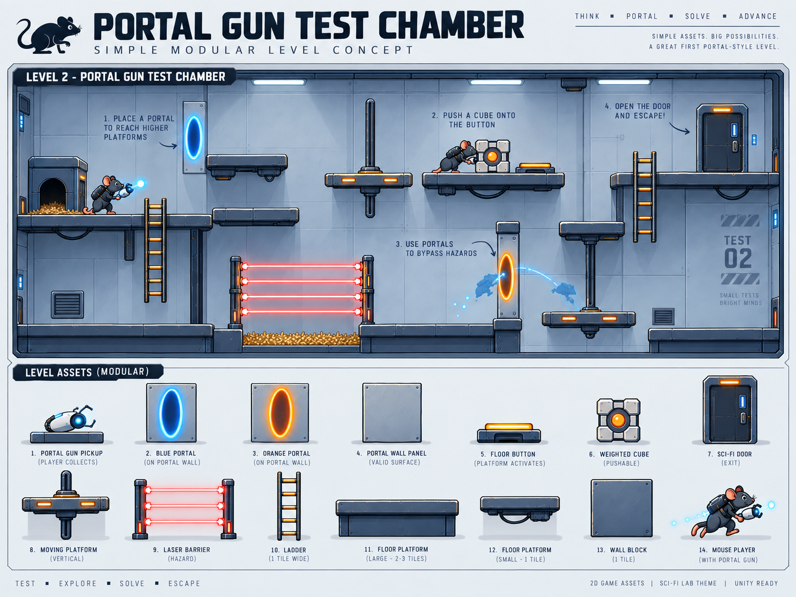
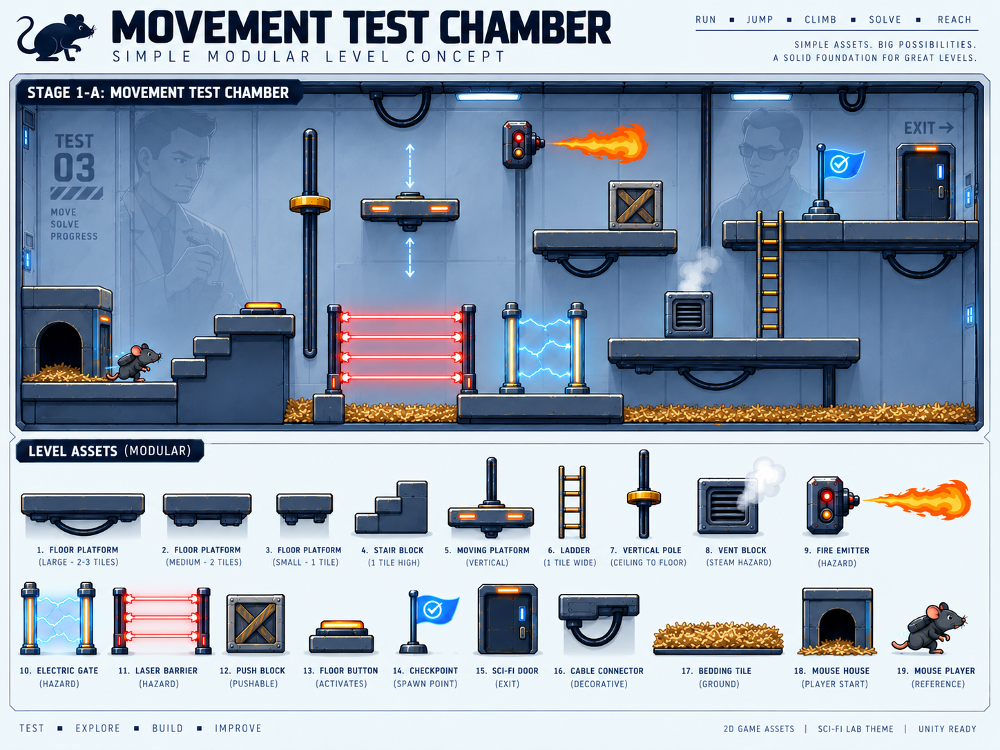

# Game Design Document

> **Test the prototype:** Open this project in Unity 6000.3.18f1 and press **Play**. The saved prototype launches automatically, even when another scene is open. No level-builder script or setup menu is required. Built players also start in the prototype.
> A/D or arrows move, Space jumps, Shift sprints, and R restarts.
> See [level design and integration notes](Documentation/PROTOTYPE_LEVEL.md).

Project files are grouped under `Assets/Scenes`, `Assets/Scripts`, `Assets/Shaders`, and `Assets/Materials`. See the [directory guide](Documentation/PROJECT_STRUCTURE.md) for the complete layout and where to make changes.

## Working Title

**Project R.A.T.** *(working title --- final name TBD)*

Possible meanings: - **Research Animal Trials** - **Rapid Augmentation Testing** - **Rodent Advancement Technology**

------------------------------------------------------------------------

# 1. Game Overview

## Core Concept

The game is a **2.5D, fixed-camera parkour platformer**. The camera stays locked to a single side-on perspective, as though the player is looking through the glass wall of a large enclosure from the outside - similar to viewing an ant farm or terrarium.

The player controls a group of **rats trapped inside a large glass enclosure**, filled with obstacles that could plausibly exist in an oversized habitat or laboratory: ramps, tubes, spinning wheels, sliding panels and moving blocks.

The player's role is to guide the rats through the enclosure from the entry point to the exit, navigating obstacles and avoiding hazards along the way.

See Illustration 1

## Related Genre(s)

-   2.5D Platformer
-   Parkour / movement-focused
-   Light puzzle-platforming

Comparable games include *Limbo* and *Inside* (fixed side-on 2.5D perspective, environmental hazards), and rodent-platformer titles more generally. Unlike these references, our game frames the entire playable space as a single glass enclosure viewed from outside, and uses a **three-rat life system** (see Section 3) rather than a single character with generic lives, giving failure a stronger physical presence in the world.

## Target Audience

The game is aimed at a general, casual audience who enjoy short, approachable platformers - players who might enjoy titles like *Limbo*, *Inside*, or mobile parkour games, but who aren't necessarily hardcore platforming fans. Because difficulty is intended to ramp up gradually and controls are kept simple, the game should also be accessible to less experienced players. This audience should be straightforward to recruit for user testing from among peers, coursemates, and casual gamers on campus.

## Unique Selling Points (USPs)

### Three-Rat Life System

The player's lives are physically represented as additional rats visibly waiting to be released into the enclosure, rather than an abstract life counter.

### The Enclosure as the Whole World

Every obstacle, hazard and section of the level exists within one continuous glass enclosure, giving the whole game a consistent, readable setting rather than disconnected levels.

### Fixed Outside-the-Glass Perspective

The permanently fixed camera angle is both a design choice and a technical one - it removes the need for complex third-person camera work while giving the game a distinct "observing a habitat" visual identity.

------------------------------------------------------------------------

# 2. Story and Narrative

## Backstory

The rats are kept inside a large glass enclosure, originally built for observation or testing. The enclosure has been fitted with a course of ramps, tubes, wheels and moving obstacles. The setting can be read either as a laboratory testing environment or an oversized pet habitat --- this ambiguity is intentional and can be resolved through background art rather than dialogue or text.

The core conflict is straightforward: the rats want to reach the exit and escape the enclosure, while the obstacles and hazards inside stand in their way.

## Characters

The rats are the only characters directly controlled by the player. There is no dialogue, narrator, or antagonist character any implied "observer" of the enclosure (e.g. a scientist or owner) is represented only through background art and props, not through spoken or written lines.

-   **Rat 1, Rat 2, Rat 3**; Functionally identical in ability, but visually distinct (see Section 5) so the player can track which rat is currently active.
-   The rats have been placed inside the enclosure for observation and must escape before the experiment is completed. Although the rats have no dialogue, their personalities are communicated through animation: one may appear cautious, another energetic, and another curious. Their shared goal is to reach the exit and escape the enclosure.

------------------------------------------------------------------------

# 3. Gameplay and Mechanics

## Player Perspective

The camera is fixed in a single 2.5D side-on position, as though looking through the glass wall of the enclosure. It does not rotate or switch to first- or third-person; it only tracks the active rat horizontally (and vertically, if sections are stacked) to keep them in frame. The player character is always visible on screen.

## Controls

| Input                       | Action            |
|:----------------------------|:------------------|
| A / D or Left / Right Arrow | Move left / right |
| Space                       | Jump              |
| (Optional) Shift            | Sprint            |

Controls are intentionally minimal, in keeping with a fixed 2.5D platformer where movement is the core mechanic.

## Progression

The enclosure is divided into a sequence of connected sections, each introducing or recombining one or two obstacle types (see Section 4). Difficulty increases gradually as sections are combined:



The player begins with **three rats**, which function as lives. A rat "dies" when it falls into a hazard (e.g. water, a crusher, or a pit) or is caught by a moving obstacle. When a rat dies, the next rat resumes from the most recent checkpoint. If all three rats die, the attempt restarts from the beginning of the enclosure.

``` text
ATTEMPT START
Rat 1 → dies → Rat 2 → dies → Rat 3 → reaches Exit → ATTEMPT SUCCESSFUL
```

``` text
ALL RATS LOST → ATTEMPT FAILED → RESTART FROM BEGINNING
```

There is no scoring system; the primary goal is reaching the exit with at least one rat remaining. This keeps the win/lose state simple and easy to communicate through UI (see Section 6).

### Core gameplay loop:

-   Navigate through the enclosure.

-   Identify and learn the behaviour of obstacles.

-   Use movement and timing to traverse each obstacle.

-   Reach checkpoints to secure progress.

-   Reach the exit with at least one rat remaining.

## Gameplay Mechanics

-   **Movement**: walking/running, jumping, falling, landing form the core mechanic set.
-   **Hazard avoidance**: obstacles such as spinning wheels or sliding panels must be timed and navigated rather than fought or destroyed.
-   **Life management**: the player must carefully traverse the obstacles to ensure they don’t lose a rat, since losing all three forces a restart.
-   **Power-ups**: the player must use different power-ups to navigate the obstacles, the power-ups are explained in the illustration.
-   These mechanics tie into the enclosure theme directly: every obstacle is something that could plausibly exist inside a glass habitat, so the mechanics and setting reinforce each other rather than requiring separate justification

## 

# 4. Levels and World Design

## Game World

The game world is **2.5D**: characters and props are modelled in 3D, but gameplay and collision are restricted to a single movement plane, viewed from a fixed camera outside the glass. This follows the "restrict gameplay to two axes, but render a 3D environment" approach.

The world is a **single continuous glass enclosure**, rather than separate levels with loading breaks. It is divided into connected sections (see Section 3, Progression) that the camera moves through as the active rat progresses. There is no map or minimap, since the enclosure is small enough to be understood visually as the player moves through it.







## Objects

| Object | Role |
|:---|:---|
| Ramps / platforms | Basic traversal, raised paths |
| Tubes | Connect sections; may briefly obscure the rat from view |
| Spinning wheel | Obstacle requiring timed jumps around its rotation |
| Sliding panel / moving block | Moving platform or wall the rat must ride or avoid |
| Water pool | Hazard --- falling in costs a life or returns the rat to the last checkpoint |
| Loose marbles / rolling objects | Unstable-footing hazard |
| Checkpoint marker | Sets the respawn point for the next rat |
| Exit | End-of-enclosure goal |

Obstacles interact with the rat (blocking, moving it, or ending its attempt on contact with a hazard) but do not otherwise interact with each other, keeping the physics simple.

## Physics

-   Standard gravity-based movement for the rat (jumping, falling).
-   Simple kinematic movement for moving obstacles (wheels rotate, panels slide on fixed paths) rather than full physics simulation, to keep behaviour predictable and easy to design around.
-   Collision is restricted to the single 2.5D movement plane described above.

------------------------------------------------------------------------

# 5. Art and Audio

## Art Style

A clean, slightly stylised look is planned, prioritising readability from the fixed camera distance over full realism:

-   High-contrast materials so obstacles read clearly against the background
-   A subtle transparent/reflective shader on the glass wall to reinforce the "looking into an enclosure" framing
-   A simple, minimal background behind the enclosure (e.g. a desk or shelf), since it is set dressing rather than playable space
-   The environment uses a **cool blue-grey sci-fi palette with dark navy structural elements, pale blue glass, white highlights, and restrained warm orange/gold accents**
-   Hazards use brighter, saturated colours (especially red, orange and electric blue) so they remain immediately readable against the cooler environment

### Colour Palette

The visual palette is based on the current level concept art:

| Colour / Use                               | Approx. Colour |
|:-------------------------------------------|:---------------|
| Deep navy / structural outlines            | `#293847`      |
| Dark blue-grey / platforms and machinery   | `#3E576E`      |
| Mid blue-grey / enclosure surfaces         | `#40617B`      |
| Muted steel blue                           | `#586B7C`      |
| Pale blue / glass and lighting             | `#80A5B5`      |
| Very pale blue-green / glass highlights    | `#8BB6B4`      |
| Off-white / bright surfaces and UI         | `#FAFAF3`      |
| Muted brown / natural enclosure elements   | `#947A55`      |
| Warm gold / bedding and accent lighting    | `#D4BA70`      |
| Bright orange / hazard and machine accents | `#F28C28`      |
| Bright red / laser hazards                 | `#FF4B4B`      |
| Electric cyan / energy effects             | `#6FE8FF`      |

The overall environment should remain predominantly **blue-grey, navy and off-white**, with orange/gold used as a secondary accent. Red lasers, orange flames and cyan electrical effects should be reserved primarily for hazards and interactive elements so that they stand out clearly.

## Sound and Music

-   Ambient background sound (room tone, distant hum) to establish the space
-   Rat sound effects: footsteps, squeaks, jump, and a stylised, non-graphic death sound
-   Obstacle sound effects: wheel spinning, panel sliding, water splash
-   A short musical cue on completing or failing an attempt

| Event \| Audio \|
| Jump \| Short rat movement sound \|
| Landing \| Soft impact \|
| Hazard \| Warning sound \|
| Rat lost \| Short non-graphic cue \|
| Checkpoint \| Positive confirmation \|
| Exit \| Completion music \|

No dialogue or voice-over is used; all feedback is communicated through sound effects, animation and UI.

## Assets

The assets we will generate ourselves due to the lack of free assets that are relevant for our game idea. We’ll use AI for help with this.


------------------------------------------------------------------------

# 6. User Interface (UI)

-   **Remaining rats**: a simple icon count (e.g. three rat icons, greyed out as rats are lost)
-   **Checkpoint indicator** (optional): shows which section the player is currently in
-   **Completion screen**: shown when a rat reaches the exit
-   **Failure / restart screen**: shown when all three rats are lost, with a prompt to restart

┌──────────────────────────────────────────┐ │ 🐀 🐀 🐀 │ │ │ │ │ │ GAMEPLAY │ │ │ │ │ │ Checkpoint ● │ └──────────────────────────────────────────┘ Wireframe sketch of HUD

The UI should use the same clean, high-contrast style as the rest of the game so it feels visually consistent with the enclosure art direction.

------------------------------------------------------------------------

# 7. Technology and Tools

| Tool | Version | Purpose | Justification |
|----|----|----|----|
| [**Unity**](https://unity.com/releases/editor/whats-new/6000.3.18f1#notes) | 6.3 LTS | Engine — movement, physics, rendering, audio, UI, WebGL build | Required by the spec. |
| **Universal Render Pipeline (URP)** | Bundled with Unity 6.3 | Rendering | Required for reliable WebGL performance and full custom shader support. Built-in RP would restrict our shader options; HDRP is not viable in a browser. |
| [**GitHub**](https://github.com) | — | Version control, collaboration, contribution tracking, GitHub Pages deployment | Required by the spec. |
| **Cg / HLSL** | — | Custom shader programs (Milestone 3, individually assessed) | Required by the spec. |
| [**Visual Studio Code**](https://code.visualstudio.com/) | Latest | C# and shader editing | Free, lightweight, good Unity and HLSL tooling. |
| [**ProBuilder**](https://docs.unity3d.com/Packages/com.unity.probuilder@latest) | Unity package | In-editor level geometry | Lets us block out and iterate on testing chambers without external 3D software — critical given no dedicated 3D artist. |
| [**Blender**](https://www.blender.org/) | 4.x | Rat model and prop adjustments | Free; used only where a team member already has the skill. |
| [**Audacity**](https://www.audacityteam.org/) | Latest | Audio trimming and processing | Free, sufficient for our needs. |
| [**GIMP**](https://www.gimp.org/) **/ [Krita](https://krita.org/)** | Latest | Textures, UI elements, corporate signage, concept art | Free. |

A fixed-camera 2.5D setup was chosen deliberately: it avoids the extra camera-collision and occlusion problems of a full third-person 3D camera, while still allowing fully 3D-modelled characters and props. This keeps the technical scope realistic for the unit's timeframe while leaving room for a consistent WebGL build (see Section 9).

------------------------------------------------------------------------

# 8. Team Communication, Timelines and Task Assignment

## Communication

$$Specify the team's communication channel(s) here, e.g. Discord/Slack,
and expected response-time norms. All project communication will be
conducted in English.$$

## Task Assignment

| Task                             | Team Member | Status      |
|:---------------------------------|:------------|:------------|
| Rat controller (movement)        | Prajeet     | Not Started |
| Fixed camera                     | Tavish      | Not Started |
| Rat model / animation            | Prajeet     | Not Started |
| Three-rat life system            | Kavish      | Not Started |
| Enclosure / level design         | Jonothan    | Not Started |
| Obstacles (wheel, panels, tubes) | Jonothan    | Not Started |
| Glass / environment art          | Jonothan    | Not Started |
| UI                               | Tavish      | Not Started |
| Audio                            | Kavish      | Not Started |

## Timeline

**Week 1** - Player controller - Basic environment - Camera **Week 2** - First obstacle - Checkpoint system - Basic UI **Week 3** - Full level - Power-ups - Audio **Week 4** - Visual polish - WebGL optimisation - Playtesting

------------------------------------------------------------------------

# 9. Possible Challenges

## Movement Feel

A platformer depends heavily on responsive controls, so the rat controller should be prototyped and tested early, before other systems are built on top of it.

## Fixed-Camera Readability

Because there is no alternate viewpoint, every obstacle and hazard needs a clear silhouette and enough contrast to read correctly from the single fixed camera angle --- this should be tested as art is added, not left until the end.

## Glass / Enclosure Shader

A convincing transparent glass shader can be a small but noticeable time sink; a simplified version is an acceptable fallback if time is limited.

## WebGL Performance

Since the game will be deployed as a WebGL build, shaders, particle effects and physics complexity should be kept modest and tested in-browser continuously during development, rather than only at the end.

## Scope Management

With several obstacle types, a life system, checkpoints, art and audio all planned, the team should prioritise finishing one complete, polished section (from entry to checkpoint) before expanding to additional sections, to ensure a playable version exists early.

------------------------------------------------------------------------

# References and Attribution

Any external assets, models, textures, images, audio, tutorials, code, AI assistance or concept references used during development will be documented here as we go on.
